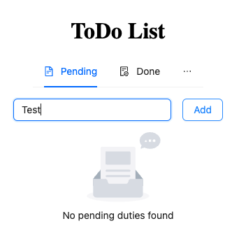
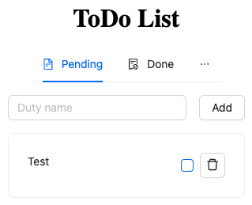
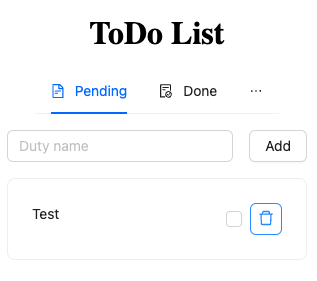
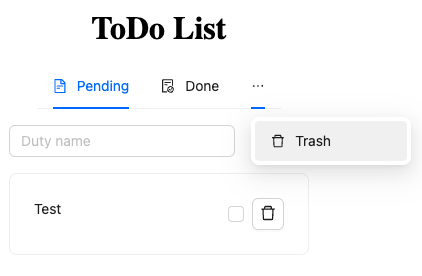
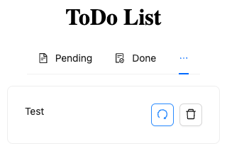
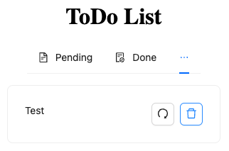

# ToDo List - Frontend

This guide will walk you through the setup, installation, and running processes to get your frontend up and running.

## Prerequisites

Before running the project, make sure you have the following installed:

-   **Node.js**: This project requires Node.js version 20. You can download it from [the official Node.js website](https://nodejs.org/).

## Setup Instructions

### Project Setup

1. Clone the repository to your local machine.
2. Install the project dependencies by running:

```bash
npm i
```

### Running the Project Locally

To run the project on your local machine:

```bash
npm run dev
```

This command starts the project on port 5173.

### Building the project

To build the project for production:

```bash
npm run build
```

This command builds the project into the `dist/` directory.

### Testing

To run the tests:

```bash
npm test
```

### Usage

#### Create duty

To create a duty, type the name in the input shown in the image, and click 'Add' or hit enter.



#### Update duty

To complete/uncomplete the duty, click on the checbox you see. This will mark the duty as completed (or uncompleted) and it will now be in the 'Done' tab (if you click on the checbox in the 'Done' tab, the duty will return to the 'Pending' tab).



#### Delete duty

To delete a duty, click on the trash button that appears.



To access the trash, click on the 3 horizontal dots and click on the option that pops up.



#### Restore duty

In the trash, there is an option to restore the duty. To move the duty back to 'Pending', click on the "arrow" button. This will send the duty back to the 'Pending' section.



#### Full delete duty

To completely remove the duty, click on the trash can. This will delete it completely and it will no longer be recoverable.


